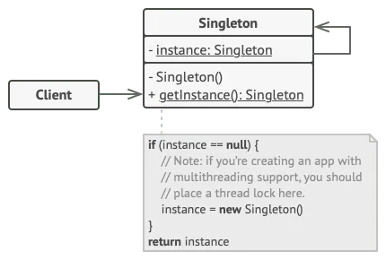

# Sintleton Pattern - Go

The Singleton pattern is a design pattern that restricts the instantiation of a class to a single instance, ensuring controlled access to that instance globally throughout an application.

We can check that using __"Race Data Detector"__ from golang, it is "-race" parameter to check race detector, which helps identify data races in concurrent programs, for example if there are two or more goroutines acessing the same varibles concurrently. 

You can do that in two different ways:
* __Not thread Safe__ - 
    * here race detector point 2-4 data races, can cause a deadlock
* __Thread Safe__ - 
    * here we are using  that is a synchronization primitive that ensure a function is executed exactly once, even across multiples goroutines


## Benefits
* __Controlled Access__: Global point of access to the instance, ensuring that all parts of the application use the same instance

* __Lazy Initialization__: The instane can be created only when it is needed

* __Reduced Memory Footprint__: Only one instance exists, it saving memory

* __Simplified Code__: Simplify the codebase and reduces the complexity of object creation

* __Thread Safety__: When implemented for, it can be made thread-safe, preventing issues in multi-threaded environments

## When to Use

* __Configuration Management__: applications settings or configurations, ensure that all the app access same configuration instance

* __Logging__: Ensure that all log messages are sent to the same log file or output stream, maintaining consistency and avoid conflicts

* __Database Connections__: Single database connection pool, reducing overhead of creating multiple connections.

* __Resource Management__: Manage shared resources, such as thread pools or caches, Singleton ensure that all components interact with same resource manager

* __Event Handling__: sometimes a single event manager is nedded to hanle events across different parts of the application, it can be centralized using Singleton

* __Service Locators__: If you are implementing a service locator pattern, using a Singleton to manage service instances can streamline access to those services


## How to execute

```
go run -race golang-singleton-once.go
```

and 

```
go run -race golang-singleton-unsafe.go
```


## Diagram


Sequence diagram




Architecture
